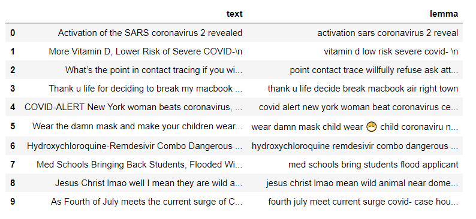
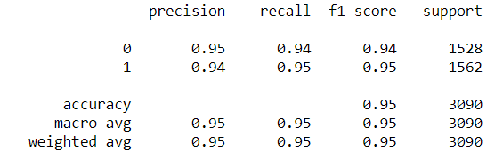

# cds490
Covid Disinformation Model

Social media exponentially improves communication across networks for all types of content - including disinformation. The novel coronavirus has been a target for disinformation campaigns with dissemination of content such as the development of vaccines,
COVID conspriracy theories targeted at Bill Gates, etc.). If instances of disinformation can be detected autonomously, moderators will be able to detect emerging content before they become viral, and launch counter messaging.

Pre-labeled data used to train a Long Short Term Memory neural network written using Tensorflow to recognize instances of COVID disinformation on Twitter. The repositories for the dataests can be found below:
1. https://github.com/Gautamshahi/Misinformation_COVID-19
2. https://github.com/apurvamulay/ReCOVery

After scraping the data (n = 10,678), the Tweets are pre-processed with the spaCy module (stopword removal, word-stemming, etc.):

The tokenized text is then used to train the LSTM model - achieving an accuracy score of .95l on the validation set.

